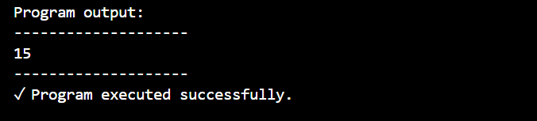
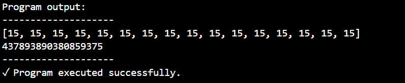

# PFL (Pure Functional Language) and Evidence with Algorithm

## Design of a Functional Programming Language Pipeline

Programming languages used by people often have many steps in between the running of the code and 
the execution of the code. It is within these steps that the scope and abilities of the code are 
determined.

For my project, I designed and implemented the processing pipeline necessary to execute an original
functional programming language. The pipeline includes 4 stages:
1. Tokenization/Lexing
2. Parsing/Generation of Abstract Syntax Tree
3. Conversion to JSON Format
4. Interpretation and Execution

### The Requirements of the Functional Programming Paradigm

The functional programming paradigm has certain requirements. Which, according to GeeksforGeeks, includes but is it not limited to (paraphrased):

 - Pure Functions
    -- Functions always produce the same output for the same arguments.
    -- There are no side-effects. They do not modify variables.

 - Recursion
    -- There are no for or while loops. The only kind of iteration is with recursion, often paired with
    if/else logic.

 - Functions are First-Class and can be Higher-Order
    -- Functions are treated as variables, meaning they are inmutable, can be passed as parameters, 
    in expressions, or returned by functions. Higher order functions can take other functions as 
    parameters.

 - Variables are Immutable
    -- All variables are inmutable, or unchangable. It is disallowed and impossible to modify the values
    of any supported variables in the language.

[https://www.geeksforgeeks.org/functional-programming-paradigm/]

### The Functionality of the Pipeline

I want to put emphasis on the design of the parser, however, which of the 4 stages of the pipeline, 
is the one most responsible for making sure that the language abides by the rules of the functional 
programming paradigm.

It's during this stage that the tokenized version of the source code has to pass through the rules of the grammar, meaning the rules govern how the code can be written: the order, the kinds of expressions, the syntax of a function, or variable declaration.

And it's precisely here where any kind of mutation to variables and/or functions is prohibited, by means of not existing in the allowed grammar. For example, a line can only be 4 different things:

    '''prolog
    % Line Possibilities
    l --> dsd. % (data structure declaration)
    l --> fd. % (function declaration)
    l --> wc. % (write command)
    l --> []. % (empty)
    '''

And going further, since a dsd (data structure definition):

    '''prolog
    % Data Structure Declarations
    dsd --> id.
    dsd --> ld.
    '''

can only be an integer declaration or list declaration:

    '''prolog
    % Integer/List Declarations
    id --> [int], ll, ['='], ie. 
    ld --> [list], ll, ['='], fcl.
    ld --> [list], ll, ['='], ['['], lc, [']'].
    '''

which require a data structure identifier 'int' or 'list' to precede a declaration expression, the grammar therefore doesn't allow any statements like the following:

    '''pfl
    int a = 10;
    a = 5;
    '''

This way and throughout the grammar, in addition to a checker function in my interpreter that probes to see whether a variable has already been set in the runtime dictionary before setting it, any modification or resetting of a variable is avoided.

## The Application of an Algorithm as Proof of Concept

In order to test this original and minimal language, I'm going to implement an algorithm which works within the functional programming paradigm. The algorithm will be the very familiar reduce function, which should properly demonstrate the functional paradigm as they are definable, callable, and return a new object without modifying the original.

### Reduce Funtion in PFL

A new file called 'reduce.pfl' is created, with the following code:

    '''pfl
    list a = [1, 2, 3, 4, 5];

    int b = 0;

    fun R(list x, int r) {
        int t = (x.head + r);
        ? (x.length <= 1) return r;
        : return R(x.popHead, t);
    };

    int y = R(a, b);

    int z = (y + a.tail);

    write(z);
    '''

By running the following command which executes the master.py file, and specifies our new .pfl file, we can run our code:

    '''bash
    python master.py reduce.pfl
    '''

And see that the result was correct:

Let's see another example, this time with a function that creates our list for us:

    '''pfl
    int g = 15;
    list h = [];

    fun B(int u, list v) {
        ? (u < v.length) return v;
        : return B(u, v.pushHead(u));
    };

    list l = B(g, h);
    write(l);

    fun R(list x, int r) {
        int t = (x.head * r);
        ? (x.length <= 1) return r;
        : return R(x.popHead, t);
    };

    int f = R(l, 1);
    write(f);
    '''

Here the list is created recursively, and we're multiplying the head value of the passed list by the recursively calculated 'r' value. After running this in the terminal with:

    '''bash
    python master.py reduce2.pfl
    '''

### Time and Space Complexity

The time complexity of calling the R reduce function is O(n), n being the length of the list passed to 
it, since it calls itself for each element in the list in order to return the reduced integer.

The space complexity of this program is also O(1), since it only produces a single integer at a time, 
which is ultimately what's returned.

### Tests to Run

There are plenty of example code files in the 'code_examples' directory to run and test. For example, 
the 'func_param.pfl' file, which displays a use of a function call being passed as a parameter inside of 
another function call, as functions should be able to do in functional programming languages, since 
they're treated as variables themselves.

All of the following commands will run pre-defined .pfl scripts:

    '''bash
    python master.py ./code_examples/func_param.pfl
    python master.py ./code_examples/another.pfl
    python master.py ./code_examples/ex.pfl
    python master.py ./code_examples/map.pfl
    python master.py ./code_examples/reverse.pfl
    python master.py ./code_examples/new.pfl
    '''

Where reverse.pfl is a basic algorithm to reverse a list, ex.pfl uses creatively the available attributes of lists, and map.pfl is an example of a customizable map function. Feel free to edit these.

### Try it Yourself

A custom program is easy to test, just create a file with literally any name and the suffic '.pfl',
and execute it with the command that calls the master.py file as seen above to run it.

For any doubts on how to write in this custom syntax, the User Guide can be found in the imgs directory.

## Analysis of Decisions Made

The pipeline is entirely built on top of python and mimics real world interpreters, which are programs that evaluate source line by line instead of compiling the entire file into an executable.

But keyword mimics, because this programming language is more of a wrapper than anything else, and it terribly unoptimized, unecessary, and should never be used in practical situations.

The pipeline looks like this:

Where the 4 stages each do a part of the processing:

1. The lexer uses python's regex library to separate the code into tokens and then evaluate that they are part of the lexicon of the language.

2. The parser calls a prolog file with a CFG that returns a basic AST if parsed correctly.

3. The converter converts this basic ast format into python friendly JSON format.

4. The interpreter evaluates each node of the ast, keeping a dictionary during the entire interpretation stage that holds the values of declared variables and functions, mimicing a real runtime environment.

### Technical Analysis of the Pipeline

The lexer uses regex and the language allows for numbers of various digits, meaning technically there is the potential for a time complexity of O(2^n), but there's also a check that makes sure that numbers don't exceed the bounds of integers in python, which prevents that. Integer and list names were specifically limited to single lower or upper characters for that reason.

The parser contains a context free grammar and parses it in a recursive descent with backtracking. This means that the quality of how the grammar is written plays a big role. I designed the grammar to never allow any infinite pattern, so it should run on a time complexity of O(n^3).

If the source code makes it past the parser, it means the syntax was good and all the rules were followed.

The converter takes that abstract syntax tree, returned as a list of declarations or nodes, and converts it into JSON format. This takes O(n) time complexity, there is no recursion or advanced algorithm.

The interpreter then evaluates each node of the JSON abstract syntax tree one by one, meaning it has the same time complexity than the code itself.